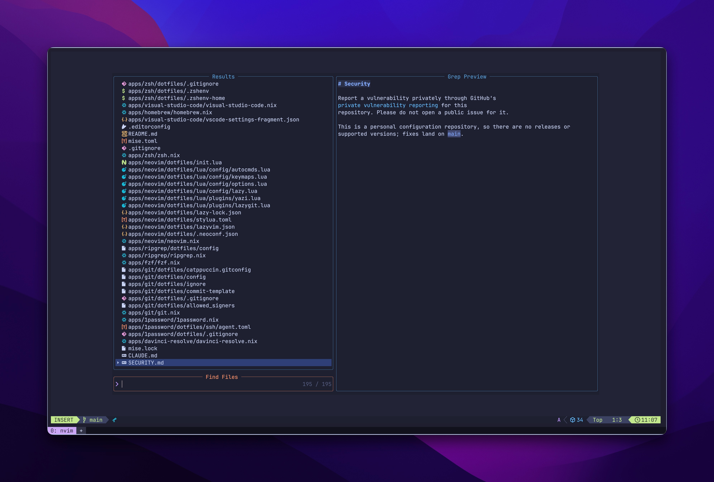
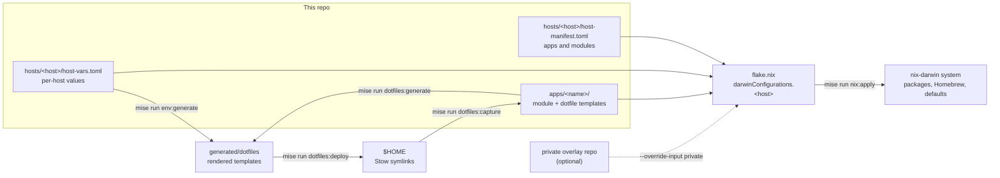

# dotfiles

[](https://github.com/husterk/dotfiles/actions/workflows/ci.yml)
[](LICENSE)
[](https://nixos.org)

My macOS setup, declared in code. One root flake builds a nix-darwin system
per machine, templated dotfiles are rendered and linked into `$HOME`, and
mise runs every task, locally and in CI. A fresh Mac gets to a working
environment with one bootstrap script, and every change is linted, tested
and built on macOS before it merges.

Most changes are made by Claude Code agents running in parallel
[Agent of Empires](https://www.agent-of-empires.com) sessions. The repo is
set up for that: every change starts from a GitHub issue, CI enforces the
link, and the agent rules are checked by linters rather than only written
down.



## Highlights

- **CI builds the real system.** Every PR is checked for formatting, lint
  and tool pins, and runs the test suites. The macOS job builds each host's
  full nix-darwin configuration from a fresh clone, with no secrets and no
  private access needed.
- **Local gates match CI exactly.** `mise run check` runs the same checks.
  CI installs nixfmt, statix, treefmt and deadnix from the nixpkgs revision
  `flake.lock` pins, so a formatter never disagrees between the two.
- **Drift checks.** `dev:check-tool-pins` fails when `mise.toml` and
  `mise.lock` disagree. `dev:check-tool-sync` fails when a tool managed by
  both mise and Nix drifts between them.
- **Machine-first editing.** Edit a dotfile in place, then
  `mise run dotfiles:capture` writes it back to its template and restores
  `${VAR}` placeholders. A round-trip test covers generate, deploy, prune
  and capture in a throwaway `$HOME`.
- **Safe with private apps.** Casks I don't publish live in a private
  overlay repo. Without it, the public stub turns off Homebrew's zap cleanup,
  so a build can never uninstall them ([ADR 3](docs/adr/0003-homebrew-zap-and-private-overlay.md)).
- **Supply chain.** Every Action is pinned to a commit SHA, workflows run
  with a read-only token, and Renovate keeps pins, digests and lockfiles
  current.
- **Agent rules with teeth.** A US-spelling scanner and a linter for Claude
  skill and agent definitions run in CI, next to evidence-labeling and
  writing rules for the agents themselves.

## How it works



- **`hosts/<host>/host-manifest.toml`** lists the modules and apps a machine
  gets, and where each app's dotfiles go.
- **`hosts/<host>/configuration.nix`** reads the manifest and
  `host-vars.toml` with `builtins.fromTOML`, so there is no code generation.
- **`apps/<name>/`** holds a nix-darwin module and optional dotfile
  templates. `docs/apps.md` lists them all.

## Quick start

Requires an Apple silicon Mac and a user matching `USER_USERNAME` in the
host's `host-vars.toml`.

```bash
xcode-select --install
git clone https://github.com/husterk/dotfiles ~/git-repos/dotfiles
~/git-repos/dotfiles/bootstrap-scripts/macos-arm64/bootstrap.sh "$(hostname -s)"
```

`bootstrap.sh` does the following:

1. Installs Nix and Homebrew.
2. Checks the host's user exists.
3. Runs the first nix-darwin switch, with the nix-darwin revision the flake
   locks.

Then open a new shell and finish:

```bash
mise run setup
```

`setup` renders and deploys the dotfiles, applies the system, installs VS
Code extensions and merges the Claude Code settings. If you keep a private
overlay, clone it to `~/git-repos/dotfiles-private` first. For a first run
without one, use `ALLOW_PUBLIC_STUB=1 mise run setup`.

On a new machine, open one more shell and run `mise run refresh`. The first
pass skips the Nushell config link and the VS Code extensions, because
their sources are not in place until the switch and deploy finish.

To adapt this for another machine, copy `hosts/keith-macbook-pro` to
`hosts/$(hostname -s)`, then edit its `host-vars.toml`, `host-manifest.toml`
and host names in `configuration.nix`.

## Day to day

| Task                                  | Command                                                                     |
| ------------------------------------- | --------------------------------------------------------------------------- |
| Apply everything after pulling        | `mise run refresh`                                                          |
| See every task                        | `mise tasks`                                                                |
| Run all CI gates locally              | `mise run check`                                                            |
| Update flake inputs                   | `mise run nix:update`                                                       |
| Check declared packages are installed | `mise run verify`                                                           |
| Edit a dotfile in place, then keep it | edit `~/.config/...`, then `mise run dotfiles:capture`                      |
| Add or remove an app                  | the `add-app` / `remove-app` Claude skills, or [docs/apps.md](docs/apps.md) |

## Claude Code setup

`apps/claude/` configures Claude Code for every session on the machine:

- **`dotfiles/CLAUDE.md` and `dotfiles/rules/`** set how agents work.
    - Clarify-or-proceed rules decide when an agent asks first.
    - Evidence labels (`Verified`, `Inferred`, `Unknown`) keep a guess from
      passing as a fact.
    - A writing standard covers every commit message, PR and doc.
- **`settings.base.json`** holds the permission rules and the model.
  `mise run refresh` merges it into `~/.claude/settings.json`, and Agent of
  Empires keeps ownership of its own hooks.
- **`dotfiles/agents/babysit-ci.md`** is a background agent. It watches a
  GitHub Actions run, maps each failing job to its local command, and fixes
  and retries within explicit stop conditions.
- **Skills:** `unslop` for prose, and in this repo `start-work`, `add-app`
  and `remove-app`.

CI gates the definitions themselves. `scripts/check-skills.py` validates
frontmatter, names and references, and `scripts/check-us-spelling.py`
enforces the spelling rule the agents are told to follow.

In this repo, agents follow an issue-first workflow
([ADR 6](docs/adr/0006-issue-first-agent-workflow.md)). They find or create
an issue with acceptance criteria, work on one branch per issue, and post
the verification evidence on the issue before merging.

## Design decisions

| ADR                                                    | Decision                                                                     |
| ------------------------------------------------------ | ---------------------------------------------------------------------------- |
| [1](docs/adr/0001-stow-and-capture.md)                 | Deploy dotfiles with Stow and capture edits back, instead of home-manager    |
| [2](docs/adr/0002-mise-alongside-nix.md)               | Use mise for repo tooling and tasks alongside Nix                            |
| [3](docs/adr/0003-homebrew-zap-and-private-overlay.md) | Declare every Homebrew package, zap the rest, keep some in a private overlay |
| [4](docs/adr/0004-root-flake-and-host-vars.md)         | One root flake and tracked, non-secret host values                           |
| [5](docs/adr/0005-imperative-activation-scripts.md)    | Keep some activation steps imperative                                        |
| [6](docs/adr/0006-issue-first-agent-workflow.md)       | Every change starts from a GitHub issue                                      |

## Repository layout

```text
flake.nix, flake.lock    root flake: one darwinConfiguration per hosts/ entry
hosts/<host>/            configuration.nix, host-manifest.toml, host-vars.toml, activation scripts
apps/<name>/             nix-darwin module and optional dotfile templates per app
modules/                 system modules shared by hosts (macOS defaults, dev tools)
nix/private-stub/        default for the private overlay input
bootstrap-scripts/       fresh-machine bootstrap and the generate, deploy, capture, apply scripts
tasks/scripts/           scripts behind the mise tasks
scripts/                 shared shell helpers and the Python checkers
tests/                   bats and Python test suites
docs/                    apps list, VS Code setup, ADRs
.claude/                 project skills and settings for Claude Code
.github/                 CI, PR policy, issue and PR templates
```

## More

- [docs/apps.md](docs/apps.md): every app and how it is installed
- [docs/vscode-setup.md](docs/vscode-setup.md): editor setup for this repo
- [CONTRIBUTING.md](CONTRIBUTING.md), [SECURITY.md](SECURITY.md),
  [THIRD_PARTY.md](THIRD_PARTY.md), [LICENSE](LICENSE)
